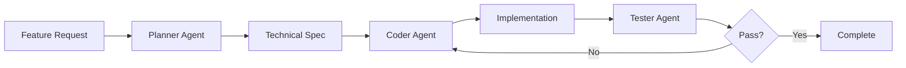

# Enhanced Development Approach with Claude Code Sub-Agents

## 🎯 Vision
Transform our development workflow by introducing specialized Claude Code sub-agents that work together to deliver higher quality code faster, with better planning, implementation, and testing.

## 🤖 Proposed Sub-Agent Architecture

### 1. **Planner Agent** (`planner`)
**Purpose**: Research, analyze, and create detailed implementation plans

**Responsibilities**:
- Analyze feature requirements and MVP specs
- Research multiple implementation approaches
- Evaluate technology choices and trade-offs
- Create detailed technical specifications
- Break down work into manageable tasks
- Update roadmap and task documentation
- Estimate effort and identify dependencies

**Tools Access**:
- Read (for analyzing existing code)
- WebSearch/WebFetch (for research)
- Grep/Glob (for codebase analysis)
- Task management commands

**System Prompt Focus**:
```
You are a senior technical architect specializing in planning and system design.
Your role is to thoroughly research, analyze, and create detailed implementation plans.
Always consider multiple approaches, evaluate trade-offs, and provide clear recommendations.
Focus on creating actionable, detailed plans that other agents can execute.
```

### 2. **Coder Agent** (`coder`)
**Purpose**: Implement features following TDD approach with clean, modular code

**Responsibilities**:
- Write production-quality code following plans
- Implement features using TDD methodology
- Create modular, maintainable code structures
- Follow project conventions and patterns
- Add descriptive comments to key functions
- Ensure code is properly typed and documented
- Handle error cases and edge conditions

**Tools Access**:
- All file manipulation tools (Read, Write, Edit)
- Bash (for running commands)
- Git operations
- Development commands (devgo, etc.)

**System Prompt Focus**:
```
You are an expert software engineer focused on implementation.
Follow TDD approach: write tests first, then implement features.
Create clean, modular code under 1500 lines per file.
Always check for existing functionality before creating new code.
Add descriptive comments to main functions and complex logic.
```

### 3. **Tester Agent** (`tester`)
**Purpose**: Code review, testing, and quality assurance

**Responsibilities**:
- Review code for quality and best practices
- Write comprehensive test cases
- Run test suites and analyze results
- Perform security and vulnerability checks
- Validate performance requirements
- Ensure documentation completeness
- Check for code duplication
- Verify error handling

**Tools Access**:
- Read-only file access
- Bash (for running tests)
- Testing commands (testgo)
- Linting and analysis tools

**System Prompt Focus**:
```
You are a quality assurance expert and code reviewer.
Focus on finding bugs, security issues, and quality problems.
Write comprehensive tests covering edge cases.
Ensure code meets project standards and best practices.
Validate that implementations match specifications.
```

## 🔄 Workflow Integration

### Standard Development Flow


### Week 1 JobDisco Example Flow

1. **Planning Phase** (Planner Agent):
   ```
   @planner Analyze Week 1 requirements for career page monitoring.
   Research web scraping approaches for job boards.
   Create technical specification for FastAPI backend.
   ```

2. **Implementation Phase** (Coder Agent):
   ```
   @coder Implement the Company and Job models following the spec.
   Use TDD approach with pytest.
   ```

3. **Testing Phase** (Tester Agent):
   ```
   @tester Review the implemented models and scraping service.
   Write integration tests for the API endpoints.
   Check for security vulnerabilities in web scraping.
   ```

## 📁 Sub-Agent Configuration Files

### `/home/duyth/projects/jobdisco/.claude/agents/planner.md`
```yaml
name: planner
description: Technical architect for research, planning, and system design. Use for analyzing requirements, researching approaches, and creating detailed implementation plans.
tools:
  - Read
  - WebSearch
  - WebFetch
  - Grep
  - Glob
  - Task
```

### `/home/duyth/projects/jobdisco/.claude/agents/coder.md`
```yaml
name: coder
description: Expert software engineer for implementing features. Use for writing code, creating tests, and building features following TDD approach.
tools:
  - Read
  - Write
  - Edit
  - MultiEdit
  - Bash
  - TodoWrite
  - TodoRead
```

### `/home/duyth/projects/jobdisco/.claude/agents/tester.md`
```yaml
name: tester
description: QA expert for code review and testing. Use for reviewing code quality, writing tests, and validating implementations.
tools:
  - Read
  - Bash
  - Grep
  - WebFetch
```

## 🚀 Enhanced Command System

### New Commands to Support Sub-Agents

#### `/plan` - Invoke Planner Agent
```markdown
Automatically invokes the planner agent to:
1. Analyze current task/feature
2. Research implementation approaches
3. Create detailed technical spec
4. Update task breakdowns
```

#### `/implement` - Invoke Coder Agent
```markdown
Automatically invokes the coder agent to:
1. Read technical spec from planner
2. Implement using TDD approach
3. Create modular, clean code
4. Update progress tracking
```

#### `/review` - Invoke Tester Agent
```markdown
Automatically invokes the tester agent to:
1. Review implemented code
2. Run existing tests
3. Write additional tests
4. Provide quality report
```

#### `/dev-cycle` - Full Development Cycle
```markdown
Orchestrates all three agents:
1. Planner creates spec
2. Coder implements
3. Tester reviews
4. Iterate until complete
```

## 🎯 Benefits of This Approach

### 1. **Specialized Expertise**
- Each agent focuses on their domain
- Deep, specialized system prompts
- Optimized tool access per role

### 2. **Better Context Management**
- Clean context for each phase
- Focused analysis without clutter
- Relevant tools only

### 3. **Quality Improvements**
- Mandatory planning phase
- Enforced code review
- Comprehensive testing

### 4. **Parallel Development**
- Multiple features can be in different phases
- Planner can work ahead on specs
- Tester can review completed work

### 5. **Clear Accountability**
- Each agent has specific responsibilities
- Easy to track which phase failed
- Clear handoffs between phases

## 📊 Success Metrics

### Development Velocity
- **Current**: 1-2 features per week
- **Target**: 3-4 features per week
- **Measurement**: Completed tasks in ROADMAP.md

### Code Quality
- **Test Coverage**: 80%+ (enforced by tester)
- **Code Review**: 100% (automatic via tester)
- **Bug Rate**: <2 bugs per feature

### Planning Accuracy
- **Spec Completeness**: 90%+ implementation coverage
- **Estimate Accuracy**: ±20% of planned time
- **Rework Rate**: <10% due to planning issues

## 🛠️ Implementation Steps

### Phase 1: Setup Sub-Agents (Week 1)
1. Create agent configuration files
2. Write detailed system prompts
3. Test each agent individually
4. Create integration commands

### Phase 2: Pilot with JobDisco (Week 1-2)
1. Use planner for Week 1 career monitoring spec
2. Use coder for FastAPI implementation
3. Use tester for API validation
4. Iterate and refine prompts

### Phase 3: Refine and Scale (Week 3-4)
1. Adjust based on pilot feedback
2. Add more specialized agents if needed
3. Create agent composition patterns
4. Document best practices

## 🔧 Advanced Agent Patterns

### 1. **Specialist Sub-Agents**
- `scraper-expert`: Specialized in web scraping techniques
- `api-designer`: Focused on REST API design
- `db-architect`: Database schema and optimization

### 2. **Agent Chaining**
```
@planner Create spec for LinkedIn integration
@api-designer Review and enhance API design
@coder Implement the enhanced design
@tester Validate against original requirements
```

### 3. **Parallel Execution**
```
# Different features in different phases
@planner Research Week 3 RSS monitoring
@coder Continue Week 1 implementation  
@tester Review completed Week 1 API
```

## 📚 Documentation Updates

### Update Existing Docs
1. **CLAUDE.md**: Add sub-agent workflow section
2. **README.md**: Include sub-agent quick start
3. **ROADMAP.md**: Mark tasks with agent assignments

### New Documentation
1. **AGENT_GUIDE.md**: Detailed agent usage guide
2. **AGENT_PATTERNS.md**: Common patterns and recipes
3. **AGENT_PROMPTS.md**: System prompt templates

## 🎉 Expected Outcomes

### Short Term (Weeks 1-2)
- Faster feature planning with planner agent
- Higher quality code from specialized review
- Better test coverage from dedicated testing

### Medium Term (Weeks 3-4)
- 50% reduction in rework
- 30% faster feature delivery
- Consistent code quality

### Long Term (Month 2+)
- Self-improving system via prompt refinement
- Reusable agent patterns
- Team scalability through standardization

---

## Next Steps

1. **Create agent configuration files** in `.claude/agents/`
2. **Test with simple tasks** to refine prompts
3. **Update commands** to support agent invocation
4. **Document patterns** as they emerge
5. **Iterate based on results**

This enhanced approach will transform JobDisco development into a more efficient, higher-quality process with specialized agents handling each phase of development.